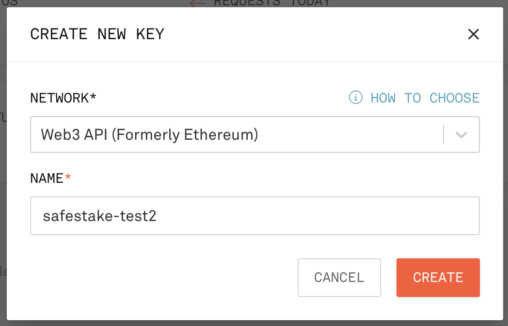
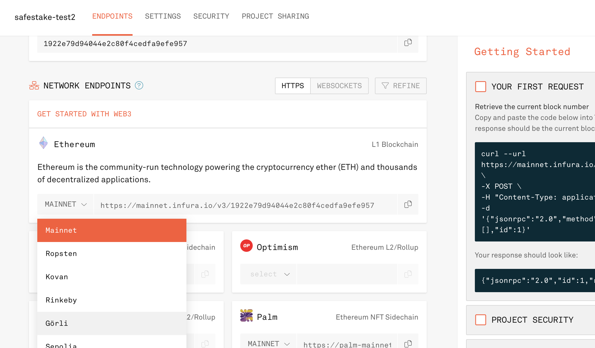
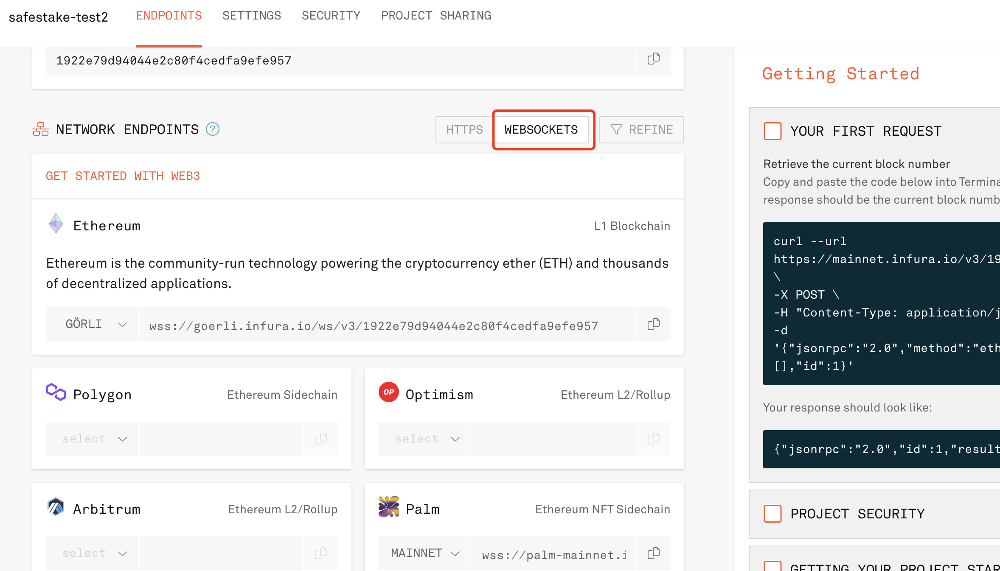
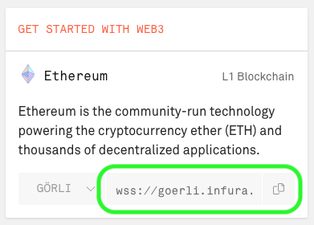
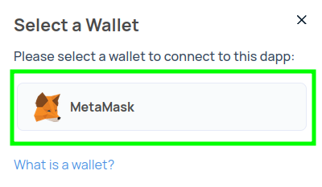
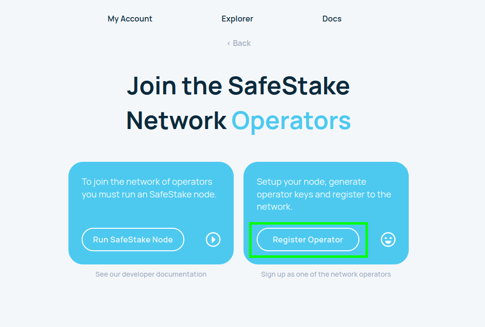
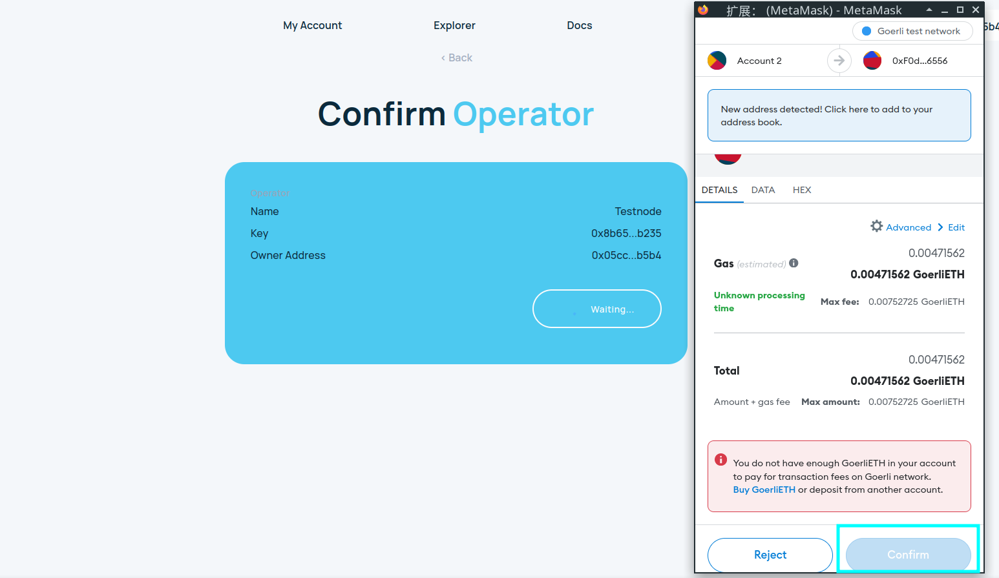

# SafeStake: Running an Operator Node (on going)

***Updates happen frequently! Our** [**Github**](https://github.com/ParaState/SafeStakeOperator) **always has the latest operator node resources and setup instructions.***


## Deploy the Operator node

### Dependencies

### Server Host

* Public Static Network IP
* Hardware
  * (Standalone Mode Recommend)
    * CPU: 16
    * Memory: 32G
    * Disk: 600GB
  * (Light Mode Recommend)
    * CPU: 2
    * Memory: 4G
    * Disk: 200GB
* OS
  * Unix
* Software
  * Docker
  * Docker Compose

### Running Mode Of Operator Node

`Standalone Mode`

Standalone mode contains the following list of programs/soft on a single host:
* Geth Service
* Lighthouse Service
* OperatorNode Service

`Light Mode`

Light mode contains only the OperatorNode service, the following list of programs/soft on a host:
* OperatorNode Service


> Geth service and Lighthouse service can run on other hosts. Users should configure the `beacon node endpoint` (discussed later) in order to connect to Lighthouse's beacon node instance.
The purpose of this is to make the architecture clearer and easier to scale operator nodes. And the cost efficiency ratio of infrastructure will be higher.

### Preparation: Get your Infura WS\_URL

* Follow the instructions found at [https://docs.infura.io/infura/](https://docs.infura.io/infura/)
* Create Infura account [here](https://app.infura.io/register) and login the account
* Create new key

<figure></figure>

* Select "WEBSOCKETS"
<figure><figcaption></figcaption></figure>

* Select "Görli" network under "Ethereum"

<figure><figcaption></figcaption></figure>

* Copy your "WS\_URL"

<figure><figcaption></figcaption></figure>


### Deployment

#### 1. Set firewall rule

Log in to your host cloud service provider, open the following firewall inbound rules:

| Type             | IpProtocol  | FromPort   | ToPort  | IpRanges |
| ---------------- | ----------- | ---------- | ------- | -------- |
| Inbound/Ingress  | tcp         | 80         | 80      | 0.0.0.0/0 |
| Inbound/Ingress  | udp         | 8585       | 8585    | 0.0.0.0/0 |
| Inbound/Ingress  | tcp         | 25000      | 25003   | 0.0.0.0/0 |
| Inbound/Ingress  | udp         | 5052       | 5052    | 0.0.0.0/0 |
| Inbound/Ingress  | udp         | 1234       | 1234    | 0.0.0.0/0 |
| Inbound/Ingress  | tcp         | 5052       | 5052    | 0.0.0.0/0 |
| Inbound/Ingress  | udp         | 9000       | 9000    | 0.0.0.0/0 |
| Inbound/Ingress  | tcp         | 30303      | 30303   | 0.0.0.0/0 |
| Inbound/Ingress  | tcp         | 8551       | 8551    | 0.0.0.0/0 |
| Inbound/Ingress  | tcp         | 443        | 443     | 0.0.0.0/0 |
| Inbound/Ingress  | udp         | 30303      | 30303   | 0.0.0.0/0 |
| Inbound/Ingress  | tcp         | 9000       | 9000    | 0.0.0.0/0 |
| Inbound/Ingress  | tcp         | 8545       | 8547    | 0.0.0.0/0 |
| Inbound/Ingress  | udp         | 9005       | 9005    | 0.0.0.0/0 |
| Inbound/Ingress  | tcp         | 8585       | 8585    | 0.0.0.0/0 |
| Inbound/Ingress  | tcp         | 22         | 22      | 0.0.0.0/0 |
| Inbound/Ingress  | tcp         | 26000      | 26005   | 0.0.0.0/0 |
| Inbound/Ingress  | udp         | 25004      | 25004   | 0.0.0.0/0 |
| Inbound/Ingress  | tcp         | 25005      | 25005   | 0.0.0.0/0 |
| Inbound/Ingress  | udp         | 26004      | 26004   | 0.0.0.0/0 |
| Inbound/Ingress  | tcp         | 3456       | 3456    | 0.0.0.0/0 |
| Inbound/Ingress  | tcp         | 3000       | 3001    | 0.0.0.0/0 |
| Inbound/Ingress  | tcp         | 1234       | 1234    | 0.0.0.0/0 |


#### 2. SSH Login to your server ([jumpserver](https://www.jumpserver.org/) recommand)

#### 3. Install Docker and Docker compose

* [install docker engine](https://docs.docker.com/engine/install/)
* [install docker compose](https://docs.docker.com/compose/install/)

#### 4. Enable docker service and start it immediately.

```
 sudo systemctl enable docker
```

#### 5. Create local volume directory

```
 sudo mkdir -p /data/geth
 sudo mkdir -p /data/lighthouse
 sudo mkdir -p /data/jwt
 sudo mkdir -p /data/operator
```

#### 6. Generate your jwt secret to jwt dirctory

```
openssl rand -hex 32 | tr -d "\n" | sudo tee /data/jwt/jwtsecret
```

#### 7. Clone operator code from Github

```
git clone --recurse-submodules https://github.com/ParaState/SafeStakeOperator.git dvf
```

#### 8. Running Geth & Lighthouse Service
NOTE: This step is to provide a quick way to setup and run the execution client and consensus client of goerli testnet. If you already have a node running execution client and consensus client, you can skip this step.

```bash
cd dvf
sudo docker compose -f docker-compose-operator.yml up geth -d
sudo docker compose -f docker-compose-operator.yml up lighthouse -d
```
NOTE: Remember to open the `5052` firewall port for this host

Syncing data may take several hours. You can use the command to see the latest logs of lighthouse to check if the data is synced:
```bash
sudo docker compose -f docker-compose-operator.yml logs -f --tail 10 lighthouse
```
Once the data is synced, you will see output like below:
```bash
INFO Synced, slot: 3690668, block: 0x1244…cb92, epoch: 115333, finalized_epoch: 115331, finalized_root: 0x0764…2a3d, exec_hash: 0x929c…1ff6 (verified), peers: 78
```

#### 9. Edit local environment variables
```bash
cp .env.example .env
vim .env
```
Now that we have open the `.env` file, we will update the values based on our own configuration.


**Leave these variables unchanged now**:
```bash
ENR=enr:-IS4QKIF_55zNM3o29E91Rj2gwjTQJHvnGVW8e--2nvsixCXCKbS0vhuBILafB1qv3AyR2GhKt611zf_x5V6zwGEmEwBgmlkgnY0gmlwhBKIH16Jc2VjcDI1NmsxoQNsOWU-IpJ0fRj4WlVELfC5HLLhzhHZr9HMsN401NGJdYN1ZHCCIy0
GETH_NETWORK=goerli
LIGHTHOUSE_NETWORK=prater
OPERATOR_NETWORK=prater
IMAGE_TAG=staging
REGISTRY_CONTRACT_ADDRESS=CfA236D32fec8Af5bCeA57C9C07D8FAE7b504523
NETWORK_CONTRACT_ADDRESS=F0d08b8730F116d0D2371359Fa044DEDdF026556
API_SERVER=https://api-testnet.safestake.xyz/v1/
# different chain has different ttd
TTD=10790000
# separated by ',' for multiple relays, such as MEV_BOOST_RELAYS=xxx,xxx,xxx
MEV_BOOST_RELAYS=https://0xafa4c6985aa049fb79dd37010438cfebeb0f2bd42b115b89dd678dab0670c1de38da0c4e9138c9290a398ecd9a0b3110@boost-relay-goerli.flashbots.net
#gas limit. [default: 30,000,000]
GAS_LIMIT_INTEGER=30000000
OPERATOR_ID=<YOUR_OPERATOR_ID>
```

**Update these variables with yours**
```bash
WS_URL= #YOUR Infura WSS URL
BEACON_NODE_ENDPOINT= # The beacon node endpoint. Depending on whether you are running single-node mode or multi-node mode, fill in the correct Lighthouse beacon node service url, e.g. http://127.0.0.1:5052 for a local node
```

For `BEACON_NODE_ENDPOINT`, if you follow the previous step to run geth and lighthouse and you want operator runs on the same machine, then you can use a local IP:

```bash
BEACON_NODE_ENDPOINT=http://127.0.0.1:5052
```

Otherwise, suppose the host where you run the Lighthouse & Geth service has an IP `12.102.103.1`, then you can set:
```bash
BEACON_NODE_ENDPOINT=http://12.102.103.1:5052
```


#### 10. Generate a registration public and private key
```bash
sudo docker compose -f docker-compose-operator.yml up dvf_key_tool
```
Output:
```
...
dvf-dvf_key_tool-1  | INFO: node public key AtzozvDHiWUpO+oJph2ikv+EyBN5pdBXsfgZqLi0+Yqd
dvf-dvf_key_tool-1 exited with code 0
```
Save the public key, which will be used later. 

#### 11. Go to [SafeStake website](https://testnet.safestake.xyz/):
* Click "Join As Operator".

<figure><figcaption></figcaption></figure>

* Select a wallet where you have enough goerli testnet token to pay minimum fee to sign a transaction.
<figure><figcaption></figcaption></figure>

* After you connect your wallet, click "Register Operator"
<figure><figcaption></figcaption></figure>

* Your wallet address is auto filled. You need to enter the "Display Name" for your node and the "Operator Public Key" got from the previous step. Then click "Next".
<figure><figcaption></figcaption></figure>

* Click "Register Operator"
<figure><figcaption></figcaption></figure>

* Wallet extension page will pop out. You need to click "Confirm" to sign the transaction.
<figure><figcaption></figcaption></figure>

After we register an Operator on the Safestake website, we will be shown our `OPERATOR ID`, which is the unique identifier we need to start with. We will need to update the OPERATOR ID to the `.env` file before running the operator service.

#### 12. Edit local environment variables for OPERATOR_ID
```bash
vim .env
```
```bash
OPERATOR_ID= #The Operator ID is the ID you receive after registering the operator on SafeStake website
```

#### 13. Start operator service

```bash
sudo docker compose -f  docker-compose-operator.yml up --force-recreate -d operator
```

*Congratulations, now the Operator program has been installed and deployed.*

---
 

### Some final notes about Operator's private/public keys

You can always view your public key in case you forget it with the command:

```
sudo docker compose -f docker-compose-operator.yml logs -f operator | grep "node public key"
```

output

> dvf-operator-1 | \[2022-08-13T16:01:33.814Z INFO dvf::node::node] node public key Al0wMNz3JpkYDH7HVp93dZfLMt1GJHypLfhwOWS0NwC/


It is a good practice to back up your operator private key file

> **Keep it safe and put it in a safe place!**

```
/data/operator/v1/prater/node_key.json
```

**`Your SafeStake Operator Node is now configured`**
